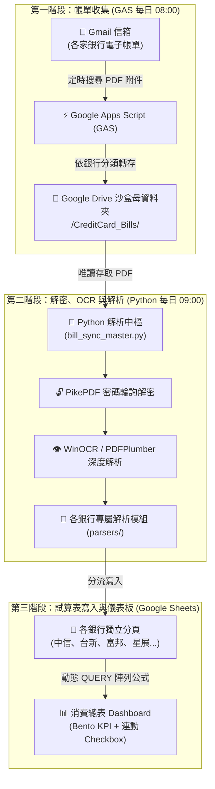

# 台灣信用卡電子帳單自動化彙整工具 (Credit Card Bill Sync)

自動將 Gmail 收到的各家銀行信用卡電子帳單 PDF，解密、解析並彙整到 Google Sheets 試算表中。支援本地執行與 GitHub Actions 每日定時自動同步。

---

## 全景運作架構圖

本專案採用**沙盒化最小權限原則**，外部執行環境（本機腳本或 GitHub Actions）完全不接觸 Gmail 郵箱本體，僅透過 Google Drive 特定資料夾作為中繼：



---

## 介面與資料夾結構圖解

### 1. Google Drive 資料夾階層與權限配置

只需將**帳單母資料夾**共用給 GCP 服務帳號（機器人），機器人便完全無法讀取你雲端硬碟中的其他個人檔案：

```
📁 Google 雲端硬碟/
└── 📁 CreditCard_Bills/               <--- 【共用給服務帳號 Email (編輯者)】(PARENT_FOLDER_ID)
    ├── 📁 中國信託/
    ├── 📁 台新銀行/
    ├── 📁 富邦銀行/
    ├── 📁 玉山銀行/
    ├── 📁 永豐銀行/
    ├── 📁 星展銀行/
    ├── 📁 第一銀行/
    └── 📁 渣打銀行/
```

### 2. Google Sheets 消費總表配置線框圖 (Dashboard Layout)

```
┌────────────────────────────────────────────────────────────────────────────────────────────────────────┐
│                                       💳 消費總表 (Executive Dashboard)                                │
├──────────────────────────┬──────────────────────────┬──────────────────────────┬───────────────────────┤
│ 💳 本期應繳總金額 (NT$)  │ 🚨 待客訴費用 (年費/利息)│ ⏳ 本期對帳進度          │ 📊 納管銀行與總筆數   │
│ NT$ 128,450              │ NT$ 3,000 (富邦年費)     │ 38 / 42 筆 (90.5%)       │ 7 家銀行 ｜ 42 筆交易 │
├──────────────────────────┴──────────────────────────┴──────────────────────────┴───────────────────────┤
│ [凍結分隔列 - 滾動時上方看板恆定顯示]                                                                   │
├────────┬────────────┬────────────┬──────────┬──────────┬────────────────────┬───────────┬─────────┬────────┤
│ [對帳] │ 消費日期   │ 入帳日期   │ 銀行名稱 │ 卡號末碼 │ 消費商家 / 項目    │ 原幣/幣別 │ 台幣金額│來源檔名│
├────────┼────────────┼────────────┼──────────┼──────────┼────────────────────┼───────────┼─────────┼────────┤
│  ☑ 已核│ 2026/09/13 │ 2026/09/17 │ 台新銀行 │   0703   │ LINE Pay＊網路購物 │           │     280 │(淡灰字)│
│  ☐ 待核│ 2026/09/05 │ 2026/09/08 │ 富邦銀行 │   8617   │ 信用卡年度年費     │           │   3,000 │[🚨紅底]│
│  ☐ 待核│ 2026/09/01 │ 2026/09/04 │ 中國信託 │   9159   │ EXIMBAY*wowpass    │ KRW 52,000│   1,201 │        │
└────────┴────────────┴────────────┴──────────┴──────────┴────────────────────┴───────────┴─────────┴────────┘
```

---

## 核心功能亮點

1. **獨立銀行分頁 (Multi-tab Storage)**：每家銀行的帳單明細各自存放於獨立分頁，方便單獨查閱與調帳。
2. **動態 QUERY 聚合總表**：消費總表採用動態陣列公式，自動聚合所有分頁明細，並依消費日期自動降冪排序。
3. **原生互動 Checkbox 與跨頁連動**：
   - A 欄為 Google Sheets 原生核取方塊。
   - 勾選「已對帳」後，該列文字自動轉為 **淺灰字體並加上刪除線**。
   - 在各銀行分頁勾選後，**消費總表 100% 同步連動打勾與消隱**。
4. **🚨 年費與違約金警報雷達**：自動偵測「年費」、「違約金」、「滯納金」、「循環利息」，命中項目自動以 **柔和紅底高亮** 標示，並於頂部看板統計金額，方便即時向銀行客服申請減免。
5. **圖片文字 OCR 引擎**：針對中國信託（特店中文圖片）與渣打銀行（特殊編碼字型），內建 Windows 原生 OCR 與座標匹配引擎，精準還原交易商家名稱。
6. **多組密碼自動輪詢**：支援多組身分證字號與自訂密碼輪詢解密，支援民國年與西元年智慧校正。

---

## 支援銀行清單

| 銀行名稱 | 解析模式 | 特殊支援特性 |
| :--- | :--- | :--- |
| **中國信託** | OCR + 向量文字 | 支援特店中文圖片 OCR 辨識、幾何座標匹配、Samsung/Apple Pay 代碼還原 |
| **台新銀行** | 向量文字層解析 | 支援卡號分組繼承、分期交易還原、跨行商家名稱合併 |
| **富邦銀行** | 向量文字層解析 | 支援民國年自動轉換、momo 退貨自動沖銷、正卡末 4 碼標頭辨識 |
| **星展銀行** | 向量文字層解析 | 支援多款聯名卡正卡標頭、生活繳費代扣還原、海外消費地代碼拆解 |
| **玉山銀行** | 向量文字層解析 | 支援 Unicard/各卡別卡號繼承、e-point 點數折抵與分期付款 |
| **永豐銀行** | 向量文字層解析 | 支援外幣與消費日 Token 拆解、自動過濾 0 元任務回饋金通知 |
| **第一銀行** | 向量文字層解析 | 支援 iLEO 信用卡與各卡別標準明細抽取 |
| **渣打銀行** | OCR + 向量文字 | 支援 LINE Bank 聯名卡與自訂編碼帳單 OCR 抽取 |
| **通用解析器** | 標準正則 Fallback | 支援其他符合標準借貸記帳版面之電子帳單 |

---

## 5 分鐘極速建置指引 (Quick Start)

### 步驟 1：雲端環境前置設定 (GCP + GDrive + GAS)

在開始執行 Python 之前，需要先建立 Google 雲端沙盒環境：

1. **建立 GCP 服務帳號**：
   - 參考 [Google Cloud 服務帳號設定指南](docs/gcp_service_account_setup.md)，透過 Google Cloud Shell 複製貼上一鍵指令，3 分鐘取得 `sa-key.json` 與服務帳號 Email。
2. **建立 GDrive 資料夾與 Google Sheet**：
   - 建立 `CreditCard_Bills` 母資料夾（內含各銀行子資料夾）以及一張空白 Google Sheet。
   - 將母資料夾與 Google Sheet 的共用權限設給**服務帳號 Email（編輯者）**。
3. **設定 Gmail 自動轉存 (GAS)**：
   - 參考 [Gmail 電子帳單自動轉存 GDrive 指南](docs/gas_gmail_to_gdrive.md)，在 Google Apps Script 貼上轉存腳本並設定每日定時觸發。

---

### 步驟 2：選擇執行方式

#### 方案 A：本地環境執行 (Local Run)

1. **安裝相依套件**：
   ```bash
   pip install -r requirements.txt
   ```
2. **設定本地環境變數 (`.env`)**：
   複製 `.env.example` 為 `.env`，並填入相關參數：
   ```env
   # PDF 密碼清單 (支援多組密碼，JSON 陣列格式)
   PDF_PASSWORDS=["A123456789", "123456"]

   # Google Sheets 試算表 ID
   SPREADSHEET_ID=your_spreadsheet_id_here

   # Google Drive 帳單母資料夾 ID
   PARENT_FOLDER_ID=your_parent_folder_id_here

   # GCP 服務帳號金鑰路徑
   SA_KEY_PATH=sa-key.json
   ```
3. **將 `sa-key.json` 放置於專案根目錄**。
4. **執行同步**：
   ```bash
   # 一般增量同步 (僅處理新進帳單)
   python bill_sync_master.py

   # 全量重建同步 (清空各分頁並重新全量掃描)
   python bill_sync_master.py --rebuild
   ```

---

#### 方案 B：GitHub Actions 雲端每日自動同步 (免開電腦)

1. **推送到 GitHub 儲存庫**：
   ```bash
   git init
   git add .
   git commit -m "feat: Initial commit of Credit Card Bill Sync Master v2.1 with OCR and Sheet Dashboard"
   git branch -M main
   git remote add origin https://github.com/<你的帳號>/<你的儲存庫名稱>.git
   git push -u origin main
   ```
2. **設定 GitHub Repository Secrets**：
   進入 GitHub 儲存庫 ➜ **Settings** ➜ **Secrets and variables** ➜ **Actions** ➜ **New repository secret**，新增 4 個密鑰：

   | Secret 名稱 | 填寫內容 |
   | :--- | :--- |
   | `GCP_SA_KEY` | `sa-key.json` 的完整 JSON 字串（含 `{}`） |
   | `PDF_PASSWORDS` | 密碼 JSON 陣列，例如 `["A123456789", "123456"]` |
   | `SPREADSHEET_ID` | Google Sheets 試算表 ID |
   | `PARENT_FOLDER_ID` | GDrive 帳單母資料夾 ID |

3. **自動排程運作**：
   - GitHub Actions 會在每日台灣時間上午 09:00 自動執行同步。
   - 也可在 GitHub **Actions** 頁籤中手動點擊 **Run workflow** 立即測試。

---

## 專案目錄結構

```
CreditCard_Bill_Sync/
├── .github/
│   └── workflows/
│       └── daily_sync.yml         # GitHub Actions 每日定時同步排程 (台灣時間 09:00)
├── parsers/                       # 各銀行獨立解析模組 (策略模式)
│   ├── __init__.py                # 解析器工廠 (get_parser)
│   ├── base_parser.py             # 抽象基類與金融工學清洗工具
│   ├── ctbc.py                    # 中國信託 (OCR + 座標匹配)
│   ├── dbs.py                     # 星展銀行
│   ├── esun.py                    # 玉山銀行
│   ├── first_bank.py              # 第一銀行
│   ├── fubon.py                   # 富邦銀行
│   ├── scb.py                     # 渣打銀行
│   ├── sinopac.py                 # 永豐銀行
│   ├── taishin.py                 # 台新銀行
│   └── generic.py                 # 通用 Fallback
├── docs/                          # 詳細設定手冊
│   ├── gcp_service_account_setup.md # GCP 服務帳號與沙盒權限指南
│   └── gas_gmail_to_gdrive.md       # Gmail 轉存 GDrive 腳本設定教學
├── bill_sync_master.py            # 核心調度腳本 (解密、抽取、寫入、排版)
├── requirements.txt               # 相依套件清單
├── .env.example                   # 本地環境變數範本 (可安全提交至 Git)
├── .gitignore                     # 嚴格排除金鑰、密碼與日誌
└── README.md                      # 專案主說明文件
```

---

## 擴充支援新銀行 (Contributing)

本專案採用策略模式（Strategy Pattern），想要增加新銀行的解析邏輯非常單純：

1. 在 `parsers/` 目錄下新增一個 Python 檔案（例如 `cathay.py`）。
2. 繼承 `BaseBankParser` 並實作 `parse_text(self, text: str, pdf: pdfplumber.PDF)` 方法。
3. 在 `parsers/__init__.py` 的工廠函式中註冊該銀行的關鍵字映射。

歡迎提交 Pull Request 或開 Issue 回報格式變更！

---

## 免責聲明 (Disclaimer)

* 本專案僅供個人資料整理、開源技術交流與學習研究使用。
* 各家銀行電子帳單排版隨時可能調整，程式解析結果可能因銀行改版或特殊交易備註而有所誤差。
* 實際信用卡消費明細、應繳總金額與繳款期限，請一律以各發卡銀行官方出具之正式帳單為準。
* 使用者執行本程式所產生之任何對帳差異或衍生問題，需由使用者自行核對與承擔。

---

## 授權條款 (License)

本專案採用 [MIT License](LICENSE) 開源授權，歡迎自由使用、修改與分享。

---

## 相關文件索引

* [Google Cloud 服務帳號與權限設定指南 (docs/gcp_service_account_setup.md)](docs/gcp_service_account_setup.md)
* [Gmail 電子帳單自動轉存 GDrive 指南 (docs/gas_gmail_to_gdrive.md)](docs/gas_gmail_to_gdrive.md)
