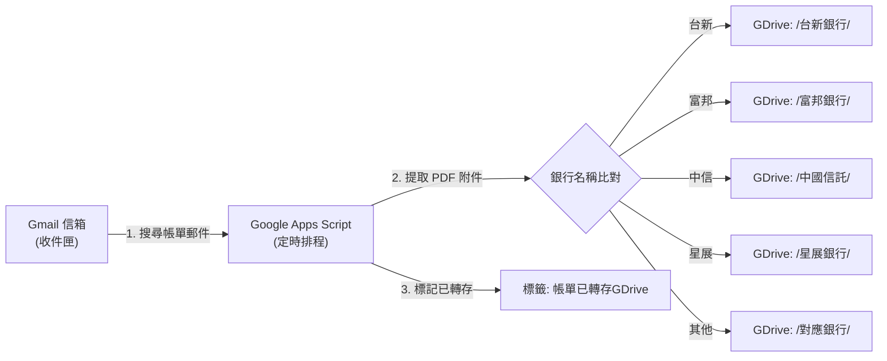

# Gmail 電子帳單自動轉存 Google Drive 設定指南 (GAS)

本指南說明如何透過 Google Apps Script (GAS) 設定定時排程，每天自動將 Gmail 收到的各家銀行信用卡電子帳單 PDF 附件，存入 Google Drive 對應的銀行資料夾中。

---

## 運作原理



---

## 步驟一：取得 GDrive 各銀行資料夾 ID

在 Google Drive 中建立一個主資料夾（例如 `信用卡帳單總庫`），並在其中建立各家銀行的子資料夾：

```
信用卡帳單總庫/ (PARENT_FOLDER)
├── 台新銀行/
├── 富邦銀行/
├── 中國信託/
├── 玉山銀行/
├── 永豐銀行/
├── 第一銀行/
├── 星展銀行/
└── 渣打銀行/
```

> 點進各銀行的資料夾，網址列最後一串英數代碼即為該資料夾的 `FOLDER_ID`（例如 `https://drive.google.com/drive/folders/1a2b3c4d5e...`）。

---

## 步驟二：建立 Google Apps Script

1. 開啟 [Google Apps Script 專案控制台](https://script.google.com/)。
2. 點擊左上角 **「新增專案」**，專案名稱命名為 `Auto_Save_CreditCard_Bills`。
3. 清空編輯器中的預設代碼，貼上以下完整程式碼：

```javascript
/**
 * 台灣信用卡電子帳單自動轉存 GDrive 腳本
 */

// 設定各銀行關鍵字與對應的 Google Drive 資料夾 ID
const BANK_CONFIG = [
  { name: "台新銀行", keywords: ["台新", "Taishin"], folderId: "填入台新資料夾ID" },
  { name: "富邦銀行", keywords: ["富邦", "Fubon"], folderId: "填入富邦資料夾ID" },
  { name: "中國信託", keywords: ["中國信託", "中信", "CTBC"], folderId: "填入中信資料夾ID" },
  { name: "玉山銀行", keywords: ["玉山", "E.SUN"], folderId: "填入玉山資料夾ID" },
  { name: "永豐銀行", keywords: ["永豐", "SinoPac"], folderId: "填入永豐資料夾ID" },
  { name: "第一銀行", keywords: ["第一銀行", "FirstBank", "iLEO"], folderId: "填入一銀資料夾ID" },
  { name: "星展銀行", keywords: ["星展", "DBS"], folderId: "填入星展資料夾ID" },
  { name: "渣打銀行", keywords: ["渣打", "Standard Chartered"], folderId: "填入渣打資料夾ID" }
];

const PROCESSED_LABEL = "帳單已轉存GDrive";

function saveBillsToDrive() {
  // 建立或取得標籤
  let label = GmailApp.getUserLabelByName(PROCESSED_LABEL);
  if (!label) {
    label = GmailApp.createLabel(PROCESSED_LABEL);
  }

  // 搜尋未處理且含有 PDF 附件的帳單信件
  const query = `filename:pdf (信用卡 OR 電子帳單 OR 帳單 OR statement) -label:${PROCESSED_LABEL}`;
  const threads = GmailApp.search(query, 0, 30);

  Logger.log(`找到 ${threads.length} 串待處理郵件`);

  for (const thread of threads) {
    const messages = thread.getMessages();
    let isThreadMatched = false;

    for (const msg of messages) {
      const subject = msg.getSubject();
      const sender = msg.getFrom();
      const combinedText = subject + " " + sender;
      const attachments = msg.getAttachments();

      for (const config of BANK_CONFIG) {
        const isMatch = config.keywords.some(kw => combinedText.includes(kw));
        if (isMatch && config.folderId && config.folderId !== "填入" + config.name + "資料夾ID") {
          const folder = DriveApp.getFolderById(config.folderId);
          
          for (const att of attachments) {
            if (att.getName().toLowerCase().endsWith(".pdf")) {
              const fileDate = Utilities.formatDate(msg.getDate(), "Asia/Taipei", "yyyyMMdd");
              const fileName = att.getName().replace(/\.pdf$/i, "") + "_" + fileDate + ".pdf";
              
              // 檢查資料夾中是否已有同名檔案，避免重複寫入
              const existingFiles = folder.getFilesByName(fileName);
              if (!existingFiles.hasNext()) {
                folder.createFile(att.copyBlob()).setName(fileName);
                Logger.log(`[成功] 已轉存 ${config.name} 帳單: ${fileName}`);
              }
              isThreadMatched = true;
            }
          }
        }
      }
    }

    if (isThreadMatched) {
      thread.addLabel(label);
    }
  }
}
```

4. 將程式碼中的 `folderId` 替換為你在步驟一取得的各銀行資料夾 ID。
5. 點擊上方 **儲存** 圖示。

---

## 步驟三：手動測試與授權

1. 點擊上方工具列的 **「執行」** 按鈕。
2. 首次執行時會彈出「需要授權」視窗：
   - 點擊「審查權限」 ➜ 選擇你的 Google 帳號。
   - 點擊「進階」 ➜ 點擊「前往 Auto_Save_CreditCard_Bills（不安全）」。
   - 點擊「允許」。
3. 檢查 Google Drive 各銀行資料夾，確認 PDF 檔案是否已成功轉存。

---

## 步驟四：設定每日定時自動觸發排程

1. 點擊左側導覽列的 **「觸發條件（鬧鐘圖示）」**。
2. 點擊右下角 **「新增觸發條件」**：
   - 選擇要執行的功能：`saveBillsToDrive`
   - 選取活動來源：`時間驅動`
   - 選取時間型觸發條件類型：`日計時器`
   - 選取當日時間：`上午 8:00 到 9:00`（早於 GitHub Actions 的 09:00 執行時間）
3. 點擊 **儲存**。

完成後，每天早上系統會自動先將收到的電子帳單轉存到 Google Drive，後續的 Python 腳本即可接棒自動解密與解析！
