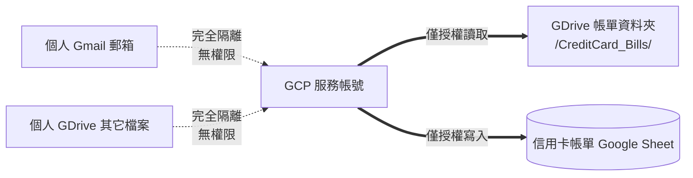

# Google Cloud 服務帳號與 Google Drive 沙盒權限設定指南

本指南說明如何透過 Google Cloud Shell 快速建立專用服務帳號（Service Account），並將 Google Drive 帳單資料夾與 Google Sheets 授權給該機器人帳號，落實最小權限原則。

---

## 權限隔離設計



---

## 一鍵建立服務帳號（使用 Google Cloud Shell）

1. 開啟 [Google Cloud Shell](https://shell.cloud.google.com/)。
2. 複製並貼上以下整段指令（按 Enter 執行）：

```bash
# 1. 建立獨立專案並切換
export MY_PROJECT_ID="fin-bill-sync-$RANDOM$RANDOM"
gcloud projects create $MY_PROJECT_ID --name="CreditCard Bill Sync"
gcloud config set project $MY_PROJECT_ID

# 2. 啟用 Drive 與 Sheets API
gcloud services enable drive.googleapis.com sheets.googleapis.com

# 3. 建立服務帳號
gcloud iam service-accounts create bill-sync-bot \
    --display-name="CreditCard Bill Sync Bot"

# 4. 取得服務帳號 Email
export SA_EMAIL="bill-sync-bot@${MY_PROJECT_ID}.iam.gserviceaccount.com"

# 5. 產生金鑰並自動下載至本機
gcloud iam service-accounts keys create sa-key.json \
    --iam-account="$SA_EMAIL"

echo "================================================================"
echo "建立完成！"
echo "服務帳號 Email: $SA_EMAIL"
echo "================================================================"

cloudshell download sa-key.json
```

3. 執行完畢後，瀏覽器會自動跳出下載 `sa-key.json` 金鑰檔案。
4. 記錄畫面上顯示的 **服務帳號 Email**（格式如 `bill-sync-bot@fin-bill-sync-xxxx.iam.gserviceaccount.com`）。

---

## Google Drive 與 Google Sheets 權限指派

1. **帳單母資料夾共用**：
   - 在 Google Drive 中找到你的信用卡帳單母資料夾（例如 `CreditCard_Bills`）。
   - 點擊右鍵 ➜ **共用** ➜ 貼上剛才的 **服務帳號 Email** ➜ 權限設為 **「編輯者」** ➜ 點擊「傳送」。
2. **Google Sheets 試算表共用**：
   - 開啟你的信用卡帳單 Google Sheets。
   - 點擊右上角 **共用** ➜ 貼上 **服務帳號 Email** ➜ 權限設為 **「編輯者」** ➜ 點擊「傳送」。

---

## 取得專案必要 ID

| 設定項目 | 取得方式 | 範例 |
| :--- | :--- | :--- |
| `PARENT_FOLDER_ID` | 開啟 GDrive 帳單母資料夾，複製網址列最後一段英數代碼 | `1a2b3c4d5e6f7g8h9i0j_EXAMPLE_FOLDER_ID` |
| `SPREADSHEET_ID` | 開啟 Google Sheet，複製網址列 `/d/` 與 `/edit` 之間的一長串代碼 | `1a2b3c4d5e6f7g8h9i0j_EXAMPLE_SHEET_ID` |

取得以上資訊後，即可填入本地 `.env` 檔案或 GitHub Secrets 中！
